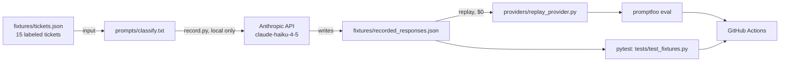

# Prompt Regression CI

A CI pipeline that catches prompt regressions on a support-ticket classifier: every push runs a fixed eval set through [Promptfoo](https://www.promptfoo.dev/) plus a fast pytest check, and fails the build if accuracy or output schema drops below a floor.


## How it works

The prompt classifies a support ticket into `{category, priority}` as JSON. CI replays pre-recorded model responses from `fixtures/recorded_responses.json` instead of calling the API, so a run costs nothing and needs no network. A green badge means the recorded responses still parse and still meet the accuracy floor. It says nothing about whether the live model has drifted since they were recorded.

Checking for drift is manual on purpose: `scripts/record.py` re-runs the prompt against the Anthropic API and overwrites the fixtures, and you review the diff before committing.

Record/replay (the same idea as VCR-style HTTP fixtures) was picked over mocks because the fixtures then hold real model output instead of hand-written guesses.

## Architecture



## Eval metrics

Computed by `scripts/metrics.py`, shared by pytest and the eval report:

| Metric | What it checks | Floor |
|---|---|---|
| Schema validity | every recorded response is valid JSON with an allowed category/priority | 100% |
| Category accuracy | recorded category matches the ticket's ground-truth label | 80% |
| Priority accuracy | recorded priority matches the ticket's ground-truth label | 80% |

Current numbers (`python3 scripts/eval_report.py`): 100% schema validity, 93.3% category accuracy, 93.3% priority accuracy on the 15-ticket fixture set.

## Setup

```bash
pip install -r requirements.txt
pytest -q --tb=short tests/                              # the enforced gate: floor thresholds
npx --yes promptfoo@latest eval -c promptfooconfig.yaml   # diagnostic per-case report, also $0
```

`promptfoo eval` exits non-zero whenever a single case misses, because it checks each case instead of a threshold. CI runs it as a report only (`|| true`), and the pytest thresholds decide pass or fail.

## Updating the prompt

1. Edit `prompts/classify.txt` (and/or `fixtures/tickets.json` for new test cases).
2. If you changed `tickets.json`, regenerate the promptfoo config: `python3 scripts/gen_promptfoo_config.py`.
3. Regenerate fixtures against the live API: `python3 scripts/record.py` (needs `ANTHROPIC_API_KEY`, costs a few cents for 15 short prompts on Haiku).
4. Review the diff in `fixtures/recorded_responses.json`. This is where a person catches a regression.
5. Commit. CI now replays the new fixtures.

## Stack

Python 3.12, pytest, [Promptfoo](https://www.promptfoo.dev/), Anthropic API (`claude-haiku-4-5`, record-only), GitHub Actions.
