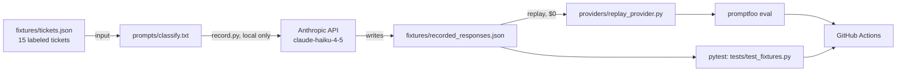

# Prompt Regression CI

A CI pipeline that catches prompt regressions on a support-ticket classifier: every push runs a fixed eval set through [Promptfoo](https://www.promptfoo.dev/) plus a fast pytest check, and fails the build if accuracy or output schema drops below a floor.


## What this is (and isn't)

The prompt classifies a support ticket into `{category, priority}` as JSON. CI runs against **pre-recorded model responses** (`fixtures/recorded_responses.json`), not live API calls, so every run is $0 and has no network dependency. That means the CI badge proves *"the fixtures still parse and still meet the accuracy floor"* — it does not prove the live model hasn't drifted since the fixtures were recorded. Catching live drift is a separate, deliberately manual step: `scripts/record.py` re-runs the real prompt against the Anthropic API and overwrites the fixtures, so you can diff and review the change before committing it.

This is a record/replay pattern (the LLM equivalent of VCR-style HTTP test fixtures), chosen over mocking so the recorded outputs are real model output, not hand-written approximations of what the model would say.

## Architecture



## Eval metrics

Computed by `scripts/metrics.py`, shared by pytest and the eval report:

| Metric | What it checks | Floor |
|---|---|---|
| Schema validity | every recorded response is valid JSON with an allowed category/priority | 100% |
| Category accuracy | recorded category matches the ticket's ground-truth label | 80% |
| Priority accuracy | recorded priority matches the ticket's ground-truth label | 80% |

Current numbers (`python3 scripts/eval_report.py`): 100% schema validity, 93.3% category accuracy, 93.3% priority accuracy on the 15-ticket fixture set.

## Setup

```bash
pip install -r requirements.txt
pytest -q --tb=short tests/                              # fast, $0, no network
npx --yes promptfoo@latest eval -c promptfooconfig.yaml   # richer per-case report, also $0
```

## Updating the prompt

1. Edit `prompts/classify.txt` (and/or `fixtures/tickets.json` for new test cases).
2. If you changed `tickets.json`, regenerate the promptfoo config: `python3 scripts/gen_promptfoo_config.py`.
3. Regenerate fixtures against the live API: `python3 scripts/record.py` (needs `ANTHROPIC_API_KEY`, costs a few cents for 15 short prompts on Haiku).
4. Review the diff in `fixtures/recorded_responses.json` — this is the actual regression check for a human.
5. Commit. CI now replays the new fixtures.

## Stack

Python 3.12, pytest, [Promptfoo](https://www.promptfoo.dev/), Anthropic API (`claude-haiku-4-5`, record-only), GitHub Actions.
